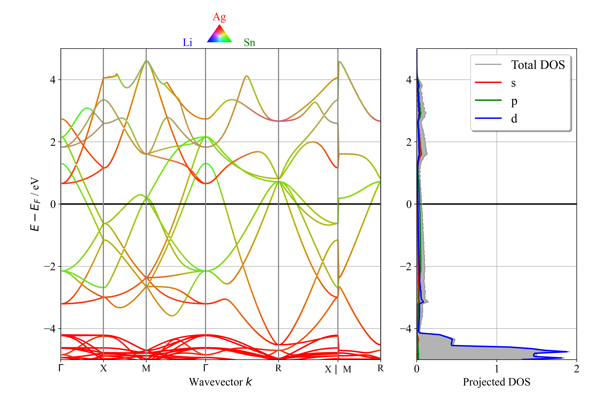

# BandStructure_VASP
With this graphical user interface (GUI), you can plot the electronic band structure including density of states (DOS) and (elemental and orbital) projected density of states (pDOS) from VASP input files. 
 
The pDOS can also be included in the electronic band structure plots. 

To launch the app, please download all files and read Thermoelectric Optimizer-SPB Model Python for more instructions.

